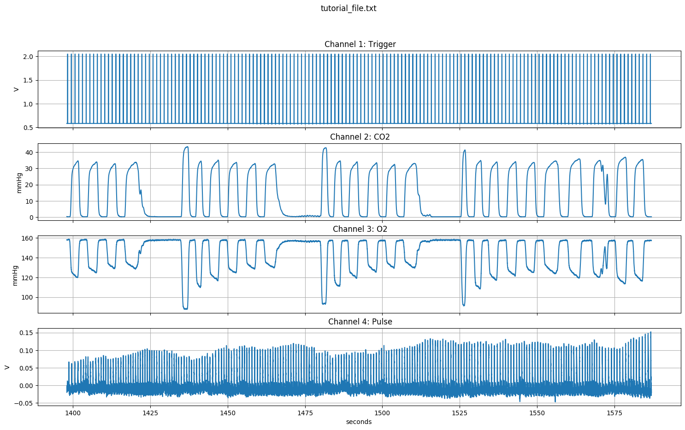
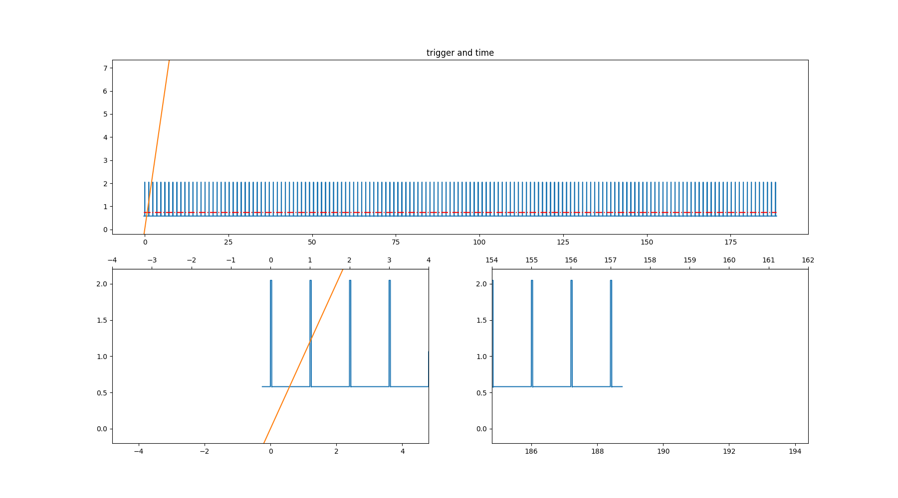
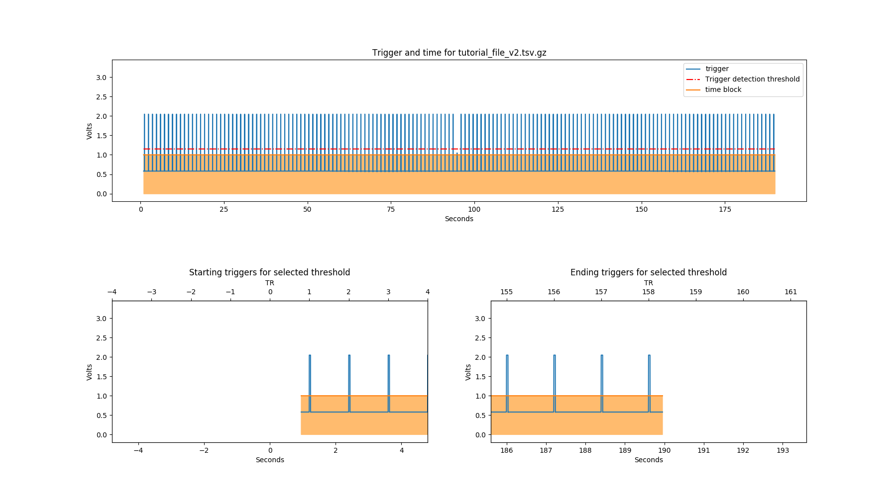

.. _howto:

========================
How to use ``phys2bids``
========================

This tutorial uses a text file exported from LabChart software. The principles of this tutorial apply for other inputs that ``phys2bids`` currently supports (AcqKnowledge native files and text files). However, future tutorials will go into the specifics of processing different inputs, as well as inputs which contain different sampling frequencies across data columns and inputs with multiple scans within one file.

This tutorial will:

1. Run ``phys2bids`` with the ``-info`` option, to show how to retrieve information about your input file.
2. Run ``phys2bids`` and explain the output files that are generated.
3. Run ``phys2bids`` with a heuristic file, showing how the input file can be outputted in BIDS format.

Setup
#####

In order to follow the tutorial, you need a very quick setup: download or clone the `github repository <https://github.com/physiopy/phys2bids>`_ and install either the latest stable or development release as described `here <installation.html#install-with-pip>`_.

.. warning::
    Before starting to use ``phys2bids``, check that you have installed all the extra modules that you need, depending on the files you will work with.

    For instance, if you are planning to process AcqKnowledge files, install the interface dependencies as described `here <installation.html#>`_.

For the tutorial, we will assume the repository was downloaded in ``/home/arthurdent/git``. Let's get there right now:

.. code-block:: shell

    cd /home/arthurdent/git/

What is in the tutorial text file?
##################################

The file can be found in ``phys2bids/phys2bids/tests/data/tutorial_file.txt``. This file has header information (first 9 lines) which phys2bids will use to process this file, alongside information directly inputted by the user. Following this header information, the data in the file is stored in a column format. In this example, we have time (column 1), MRI volume trigger pulse (column 2), CO2 (column 3), O2 (column 4) and cardiac pulse (column 5) recordings. Each column was sampled at 1000Hz (Interval = 0.001 s).

.. literalinclude:: ../phys2bids/tests/data/tutorial_file.txt
   :linenos:
   :lines: 1-15

.. note::
    time is not a "real" channel recorded by LabChart or AcqKnowledge. For this reason, ``phys2bids`` treats it as a hidden channel, always in position 0. Channel 1 will be classed as the first channel recorded in either software.

Using the -info option
######################

First, we can see what information ``phys2bids`` reads from the file, and make sure this is correct before processing the file.

The simplest way of calling ``phys2bids`` is moving to the folder containing the physiological file and typing:

.. code-block:: shell

    cd phys2bids/phys2bids/tests/data/
    phys2bids -in tutorial_file

``phys2bids`` will try to get the extension for you.
However, we’ll use one more argument to have a sneak peak into the content of the file:

.. code-block:: shell

    phys2bids -in tutorial_file.txt -info

This ``-info`` argument means ``phys2bids`` does not process the file, but only outputs information it reads from the file, by printing to the terminal and outputting a png plot of the data in the current directory:

.. code-block:: shell

    INFO:phys2bids.phys2bids:Currently running phys2bids version v1.3.0-beta+149.ge4a3c87
    INFO:phys2bids.phys2bids:Input file is tutorial_file.txt
    INFO:phys2bids.utils:File extension is .txt
    WARNING:phys2bids.utils:If both acq and txt files exist in the path, acq will be selected.
    INFO:phys2bids.phys2bids:Reading the file ./tutorial_file.txt
    INFO:phys2bids.interfaces.txt:phys2bids detected that your file is in Labchart format
    INFO:phys2bids.phys2bids:Reading infos
    INFO:phys2bids.physio_obj:
    ------------------------------------------------
    File tutorial_file.txt contains:
    01. Trigger; sampled at 1000.0 Hz
    02. CO2; sampled at 1000.0 Hz
    03. O2; sampled at 1000.0 Hz
    04. Pulse; sampled at 1000.0 Hz
    ------------------------------------------------

    INFO:phys2bids.viz:saving channel plot to tutorial_file.png

When using the ``-info`` option, the channel plot will always be made. It will be saved as a png file in your working directory, with the *same name* as your input filename. If you want to change the filename and output location, you can use the ``-chplot`` argument, which allows you to specify the name (and full path) for the output of this channel plot.

Now we know that the file contains four channels, sampled at the same frequency, and that the trigger is in the first column. All this information will become useful.

Generating outputs
##################

Specifying paths and names
^^^^^^^^^^^^^^^^^^^^^^^^^^

Next, we'll call ``phys2bids`` without the ``-info`` option. We'll use the same inputs as above, as well as adding ``-indir`` and ``-outdir``. If you use ``-indir`` you can specify a path to your input file i.e. it does not have to be in the current directory, as is the default. (The ``-indir`` argument can also be used alongside the ``-info`` argument).

When calling ``phys2bids`` without the ``-info`` argument, it will generate files; if you use the ``-outdir`` argument this is where ``phys2bids`` will save these files. If the output folder doesn't exist, it will be created.

.. code-block:: shell

    phys2bids -in tutorial_file.txt -indir /home/arthurdent/git/phys2bids/phys2bids/tests/data/ -outdir /home/arthurdent/physio

This is outputted to the terminal:

.. code-block:: shell

    INFO:phys2bids.phys2bids:Currently running phys2bids version v1.3.0-beta+149.ge4a3c87.dirty
    INFO:phys2bids.phys2bids:Input file is tutorial_file.txt
    INFO:phys2bids.utils:File extension is .txt
    WARNING:phys2bids.utils:If both acq and txt files exist in the path, acq will be selected.
    INFO:phys2bids.phys2bids:Reading the file /home/arthurdent/git/phys2bids/phys2bids/tests/data/tutorial_file.txt
    INFO:phys2bids.interfaces.txt:phys2bids detected that your file is in Labchart format
    INFO:phys2bids.phys2bids:Reading infos
    INFO:phys2bids.physio_obj:
    ------------------------------------------------
    File tutorial_file.txt contains:
    01. Trigger; sampled at 1000.0 Hz
    02. CO2; sampled at 1000.0 Hz
    03. O2; sampled at 1000.0 Hz
    04. Pulse; sampled at 1000.0 Hz
    ------------------------------------------------

    WARNING:phys2bids.phys2bids:Skipping trigger pulse count. If you want to run it, call phys2bids using "-ntp" and "-tr" arguments
    INFO:phys2bids.phys2bids:Preparing 1 output files.
    INFO:phys2bids.phys2bids:Exporting files for freq 1000.0
    INFO:phys2bids.phys2bids:
    ------------------------------------------------
    Filename:            tutorial_file.txt

    Timepoints expected: 0
    Timepoints found:    None
    Sampling Frequency:  1000.0 Hz
    Sampling started at: -1398.0 s
    Tip: Time 0 is the time of first trigger
    ------------------------------------------------

Four files have been generated in the output directory:

- **tutorial_file.log**
    The same information outputted to the terminal at the end of the call.
- **tutorial_file.tsv.gz**
    Compressed file in ``tsv`` format containing your data without header information.
- **tutorial_file.json**
    As phys2bids is designed to be BIDs compatible, this is one of the two necessary BIDs files. It describes the content of your ``tsv.gz`` file.
- **phys2bids_yyyy-mm-ddThh:mm:ss.tsv**
    This is the logger file. It contains the full terminal output of your ``phys2bids`` call.

When calling ``phys2bids`` without using the ``-info`` option, the channel plot will not be automatically outputted. If you still want it to be outputted, use the ``-chplot``, as explained in the previous section.
Unless specified with ``-chsel``, ``phys2bids`` will process and output all channels. Unless specified with ``-chnames``, ``phys2bids`` will read the channel names from the header information in the file. In this tutorial, we are processing all channels and reading the names from the header information.

Finding the "start time"
^^^^^^^^^^^^^^^^^^^^^^^^

If you're just transforming files into ``tsv.gz``, **you can ignore this**. If you recorded the trigger of your (f)MRI, ``phys2bids`` can use it to detect the moment in your input file in which you started sampling your (f)MRI data, and set the "0" time to be that point.

First, we need to ensure ``phys2bids`` knows where our trigger channel is, and for this we can use the argument ``-chtrig``. ``-chtrig`` has a default of 1.
For the text file used in this example, the trigger information is the second column of the raw file; the first recorded channel. Remember, ``phys2bids`` treats time as a hidden channel, always in position 0.
Look back at the last command line output, from the section above. It said "Skipping trigger pulse count. If you want to run it, call phys2bids using "-ntp" and "-tr" arguments". Also, it told us 0 timepoints were expected and none were found. So, we need to give ``phys2bids`` some more information for it to correctly read the trigger information in the data. In this tutorial file, there are 158 time points (triggers) and the TR is 1.2 seconds. Using these arguments, we can call ``phys2bids`` again:

.. code-block:: shell

    phys2bids -in tutorial_file.txt -indir /home/arthurdent/git/phys2bids/phys2bids/tests/data/ -chtrig 1 -ntp 158 -tr 1.2 -outdir /home/arthurdent/physio

Now the output says:

.. code-block:: shell

   INFO:phys2bids.physio_obj:Counting trigger points
   INFO:phys2bids.physio_obj:The number of timepoints according to the std_thr method is 158. The computed threshold is 1.1523587407910223
   INFO:phys2bids.physio_obj:Checking number of timepoints
   INFO:phys2bids.physio_obj:Found just the right amount of timepoints!
   INFO:phys2bids.phys2bids:Plot trigger
   INFO:phys2bids.phys2bids:Preparing 1 output files.
   INFO:phys2bids.phys2bids:Exporting files for freq 1000.0
   INFO:phys2bids.phys2bids:
   ------------------------------------------------
   Filename:            tutorial_file.txt

   Timepoints expected: 158
   Timepoints found:    158
   Sampling Frequency:  1000.0 Hz
   Sampling started at: 0.2460000000000946 s
   Tip: Time 0 is the time of first trigger
  ------------------------------------------------

``phys2bids`` has an automatic way of finding the right threshold, in order to find the correct number of timepoints, by using the mean and standard deviation of the trigger channel. If "Found just the right amount of timepoints!" appears everything should be working properly!

Alright, so now we have some outputs that make sense! We have 158 timepoints expected (as inputted with ``-ntp``) and found. The output also tells us that the fMRI sampling started around 0.25 seconds later than the start of this physiological sampling.

Notice that an extra file has been generated, called "tutorial_file_trigger_time.png". This is because we used the ``-ntp`` and ``-tr`` arguments.

In the first row of this plot, the whole trigger channel is plotted in blue. The orange block shows where the time starts and ends (i.e. the start and end of your fMRI recording).
In the second row, we see the first and last trigger (or expected first and last). The red dotted line represents the trigger detection threshold.

.. warning::
    If you have another file that was collected in an identical way, the threshold is likely to be same. However, it is *very* important to calibrate the threshold in a couple of files before assuming this. This still *won't* necessarily mean that it's the right threshold for all the files, but there's a chance that it's ok(ish) for most of them.

If for some reason ``-ntp`` and the number of timepoints found by ``phys2bids`` is not the same there are two possible reasons:

1. You didn't properly count the number of timepoints. Check this again; you can use the trigger png file to help you.
2. The automatic threshold is not working. This may happen if the MRI trigger pulses vary in amplitude, and some are lower than the automatic threshold found. Don't Panic. We have a solution for that - you can use the ``-thr`` option to manually input a different threshold. Change the ``-thr`` until the number of  timepoints founds are the same as the expected timepoints (``-ntp``).
3. The file doesn't have all the trigger pulses you expect because the recording started later than the MRI recording (e.g. by mistake).

.. note::
    ``phys2bids`` was created to deal with little sampling errors - such as distracted researchers that started sampling a bit too late than expected. For this reason, if it finds less trigger pulses than the amount specified, it will assume that the missing ones are at the beginning and anticipate the starting time consequently.

Let's go through an example where the number of timepoints automatically found is not correct. For that, will we use tutorial_file_v2.txt (in the same location as tutorial_file.txt):

.. code-block:: shell

    phys2bids -in tutorial_file_v2.txt -indir /home/arthurdent/git/phys2bids/phys2bids/tests/data/ -chtrig 1 -ntp 158 -tr 1.2 -outdir /home/arthurdent/physio_v2

The output:

.. code-block:: shell

    ------------------------------------------------
    File tutorial_file_v2.txt contains:
    01. Trigger; sampled at 1000.0 Hz
    02. CO2; sampled at 1000.0 Hz
    03. O2; sampled at 1000.0 Hz
    04. Pulse; sampled at 1000.0 Hz
    ------------------------------------------------

    INFO:phys2bids.physio_obj:Counting trigger points
    INFO:phys2bids.physio_obj:The number of timepoints according to the std_thr method is 157. The computed threshold is 1.1506959325294588
    INFO:phys2bids.physio_obj:Checking number of timepoints
    WARNING:phys2bids.physio_obj:Found 1 timepoints less than expected!
    WARNING:phys2bids.physio_obj:Correcting time offset, assuming missing timepoints are at the beginning (try again with a more conservative thr)
    INFO:phys2bids.phys2bids:Plot trigger
    INFO:phys2bids.phys2bids:Preparing 1 output files.
    INFO:phys2bids.phys2bids:Exporting files for freq 1000.0
    INFO:phys2bids.phys2bids:
    ------------------------------------------------
    Filename:            tutorial_file_v2.txt

    Timepoints expected: 158
    Timepoints found:    157
    Sampling Frequency:  1000.0 Hz
    Sampling started at: -0.9539999999999509 s
    Tip: Time 0 is the time of first trigger
    ------------------------------------------------

There is one trigger that ``phys2bids`` couldn't find automatically. We can work out that this is a trigger in the middle of the file, if we look at the png file that has been outputted:

By looking at this figure, we can work out that we need a smaller threshold in order to include the first time point. This can be implemented with the ``-thr`` argument:

.. code-block:: shell

    phys2bids -in tutorial_file_v2.txt -indir /home/arthurdent/git/phys2bids/phys2bids/tests/data/ -chtrig 1 -ntp 158 -tr 1.2 -thr 1.04 -outdir /home/arthurdent/physio_v2

    INFO:phys2bids.physio_obj:Counting trigger points
    INFO:phys2bids.physio_obj:The number of timepoints found with the manual threshold of 1.04 is 158.
    INFO:phys2bids.physio_obj:Checking number of timepoints
    INFO:phys2bids.physio_obj:Found just the right amount of timepoints!
    INFO:phys2bids.phys2bids:Plot trigger
    INFO:phys2bids.phys2bids:Preparing 1 output files.
    INFO:phys2bids.phys2bids:Exporting files for freq 1000.0
    INFO:phys2bids.phys2bids:
    ------------------------------------------------
    Filename:            tutorial_file_v2.txt

    Timepoints expected: 158
    Timepoints found:    158
    Sampling Frequency:  1000.0 Hz
    Sampling started at: 0.2460000000000946 s
    Tip: Time 0 is the time of first trigger
    ------------------------------------------------

Splitting your input file into multiple run output files
^^^^^^^^^^^^^^^^^^^^^^^^^^^^^^^^^^^^^^^^^^^^^^^^^^^^^^^^

If your file contains more than one (f)MRI acquisition (or runs), you can provide multiple values to ``-ntp`` in order to get multiple ``.tsv.gz`` outputs. If the TR of the entire session is consistent (i.e. all your acquisitions have the same TR), then you can specify one value after ``-tr``.

By specifying the number of timepoints in each acquisition, ``phys2bids`` will recursively cut the input file by detecting the first trigger of the entire session and the ones after the number of timepoints you specified.

.. code-block:: shell

    phys2bids -in two_scans_samefreq_all.txt -chtrig 2 -ntp 536 398 -tr 1.2 -thr 2

Now, instead of counting the trigger timepoints once, ``physbids`` will check the trigger channel recursively with all the values listed in ``-ntp``. The logger will inform you about the number of timepoints left at each iteration.

.. code-block:: shell

    INFO:phys2bids.physio_obj:Counting trigger points
    INFO:phys2bids.physio_obj:The trigger is in channel 2
    INFO:phys2bids.physio_obj:The number of timepoints found with the manual threshold of 2.0000 is 934
    INFO:phys2bids.physio_obj:Checking number of timepoints
    INFO:phys2bids.physio_obj:Found just the right amount of timepoints!
    WARNING:phys2bids.slice4phys:
    ~~~~~~~~~~~~~~~~~~~~~~~~~~~~~~~~~~~~~~~~~~~~~~~~~~~~~~~~~~~~~~~~~~~~~~~~~~~~~~
    phys2bids will split the input file according to the given -tr and -ntp arguments
    ~~~~~~~~~~~~~~~~~~~~~~~~~~~~~~~~~~~~~~~~~~~~~~~~~~~~~~~~~~~~~~~~~~~~~~~~~~~~~~
    INFO:phys2bids.physio_obj:Counting trigger points
    INFO:phys2bids.physio_obj:The trigger is in channel 2
    INFO:phys2bids.physio_obj:The number of timepoints found with the manual threshold of 2.0000 is 934
    INFO:phys2bids.physio_obj:Checking number of timepoints
    WARNING:phys2bids.physio_obj:Found 398 timepoints more than expected!
    Assuming extra timepoints are at the end (try again with a more liberal thr)
    INFO:phys2bids.slice4phys:
    --------------------------------------------------------------
    Slicing between 0.0 seconds and 961.381 seconds
    --------------------------------------------------------------
    INFO:phys2bids.physio_obj:Counting trigger points
    INFO:phys2bids.physio_obj:The trigger is in channel 2
    INFO:phys2bids.physio_obj:The number of timepoints found with the manual threshold of 2.0000 is 400
    INFO:phys2bids.physio_obj:Checking number of timepoints
    WARNING:phys2bids.physio_obj:Found 2 timepoints more than expected!
    Assuming extra timepoints are at the end (try again with a more liberal thr)
    INFO:phys2bids.slice4phys:
    --------------------------------------------------------------
    Slicing between 952.381 seconds and 1817.96 seconds
    --------------------------------------------------------------
    INFO:phys2bids.viz:Plot trigger
    INFO:phys2bids.viz:Plot trigger
    INFO:phys2bids.phys2bids:Preparing 2 output files.
    INFO:phys2bids.phys2bids:Exporting files for run 1 freq 1000.0

The logger also notifies the user about the slicing points used (the first always being from the beginning of session, until the specified number of timepoints after the first trigger). The user can also check the resulting slice by looking at the plot of the trigger channel for each run. Each slice is adjusted with a padding after the last trigger. Such padding can be specified while calling ``phys2bids`` with ``-pad``. If nothing is specified, the default value of 9 seconds will be used. This padding is also applied at the beginning (before the first trigger of the run) of the 2nd to last run.

What if I have multiple acquisition types ?
*******************************************

The user can also benefit from this utility when dealing with multiple **acquisition types** such as different functional scans with different TRs. Like ``-ntp``, ``-tr`` can take multiple values. **Though, if more than one value is specified, they require the same amount of values**. The idea is simple: if you only have one acquisition type, the one ``-tr`` input you gave will be broadcast through all runs, but if you have different acquisition types, you have to list all of them in order.

.. warning::
    There are currently no ``multi-run tutorial files`` available along with the package (under ``phys2bids/tests/data``). Although, you can visit `phys2bids OSF <https://osf.io/3txqr/files/>`_ storage to access a LabChart physiological recording with multiple fMRI acquisitions. Find it under ``labchart/chicago``.

.. note::
    **Why would I have more than one fMRI acquisition in the physiological recording?**

    The idea is to reduce human error and have a good padding around your fMRI scan!

    Synchronization between start of both fMRI and physiological acquisitions can be difficult, so it is safer to have as few physiological recordings as possible, with multiple imaging sequences.

    Moreover, if you want to correct for recording/physiological delays, you will love *that bit of recorded information* around your fMRI scan!

Generating outputs in BIDs format
#################################

Alright, now the really interesting part! This section will explain how to use the ``-heur``, ``-sub``, and ``-ses`` arguments, to save the files in BIDs format. After all, that's probably why you're here.

``phys2bids`` uses heuristic rules *à la* `heudiconv <https://github.com/nipy/heudiconv>`_. At the moment, it can only use the name of the file to understand what should be done with it but we're working on making it *smarter*. There is a complete heuristic file for the tutorial, in the ``heuristics`` folder. Inside it looks more or less like this:

.. literalinclude:: ../phys2bids/heuristics/heur_tutorial.py
   :linenos:
   :lines: 44-62
   :lineno-start: 44

The heuristic file has to be written accordingly, with a set of rules that could work for all the files in your dataset. You can learn more about it if you check the `guide on how to set it up <heuristic.html>`_.
In this case, our heuristic file looks for a file that contains the name ``tutorial``. It corresponds to the task ``test`` and run ``00``. Note that **only the task is required**, all the other fields are optional - look them up in the BIDs documentation and see if you need them.

As there might not be a link between the physiological file and the subject (and session) that it relates to, ``phys2bids`` requires such information to be given from the user. In order for the *BIDsification* to happen, ``phys2bids`` needs the **full path** to the heuristic file, as well as the subject label. The session label is optional. The ``-outdir`` option will become the root folder for your BIDs files - i.e. your *site folder*:

.. code-block:: shell

    phys2bids -in tutorial_file.txt -indir /home/arthurdent/git/phys2bids/phys2bids/tests/data/ -chtrig 1 -ntp 158 -tr 1.2 -outdir /home/arthurdent/physio -heur /home/arthurdent/git/phys2bids/phys2bids/heuristics/heur_tutorial.py -sub 006 -ses 01

The output will look very similar to our previous calls, when we did not use the ``-heur``, ``-sub`` and ``-ses`` arguments. However, there is one extra line in command line output:

.. code-block:: shell

    INFO:phys2bids.phys2bids:Preparing BIDS output using /home/arthurdent/git/phys2bids/phys2bids/heuristics/heur_tutorial.py

Now let's check the outputs it has generated. In the ``-outdir`` you will see a png file and tsv logger file, like before (now with some different file names).
You will also see a folder for the specified subject, that (optionally) contains a folder for the session, containing a folder for the functional data, containing the log file and the required BIDs files with the right name!

.. code-block:: none

    - /home/arthurdent/physio_bids /
        - tutorial_file_sub-006_sub-01_trigger_time.png
        - phys2bids_yyyy-mm-ddThh:mm:ss.tsv
        - sub-006 /
            - ses-01 /
                - func /
                    - sub-006_ses-01_task-test_rec-labchart_run-00_physio.json
                    - sub-006_ses-01_task-test_rec-labchart_run-00_physio.tsv.gz
                    - sub-006_ses-01_task-test_rec-labchart_run-00_physio.log

.. note::
    The main idea is that ``phys2bids`` should be called through a loop that can process all the files of your dataset. It's still a bit cranky, but we're looking to implement *smarter* solutions.

.. warning::
    Do not edit the heuristic file under where it says 'Don't modify below this!'.

One last thing left to do: take these files, remove the logs, and share them in public platforms!
